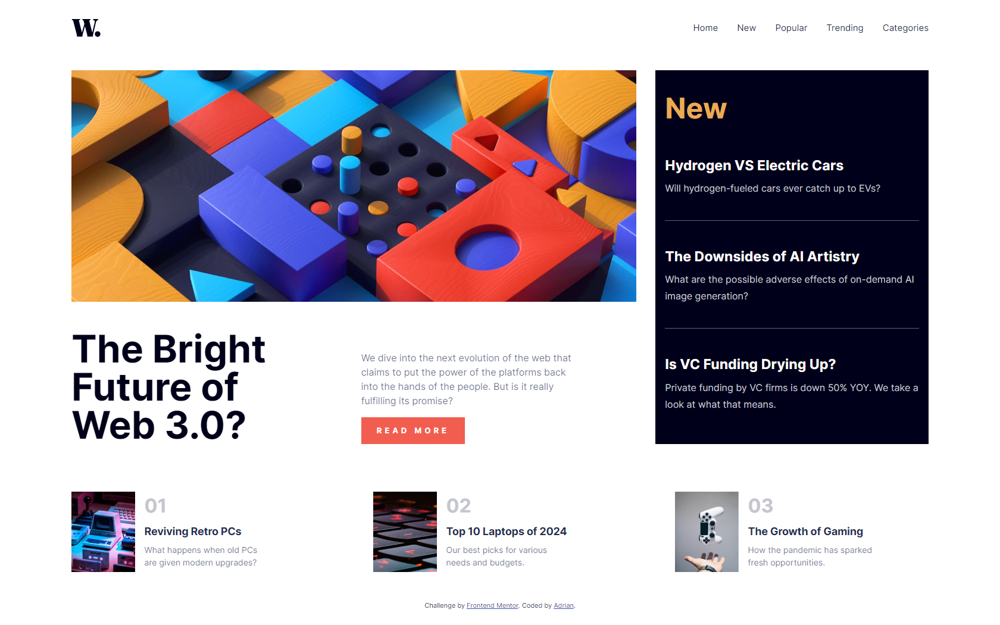

<div align="center">

  

  <h2>News homepage</h2>

  <h3>
    <a href="(https://www.frontendmentor.io/solutions/news-homepage-using-grid-flex-and-custom-properties-1H6M2uRNZn)">
      <strong>Frontend Mentor</strong>
    </a>
  </h3>

  <br>

  <div align="center">
    <a href="https://news-homepage-3.netlify.app/">View Demo</a>
  </div>

</div>

#

<div align="center">


</div>

This is a solution to the [Room homepage]((https://www.frontendmentor.io/challenges/room-homepage-BtdBY_ENq). Frontend Mentor challenges help you improve your coding skills by building realistic projects.

<h2>Links</h2>

- Solution URL: [Room homepage | Frontend Mentor](https://www.frontendmentor.io/solutions/news-homepage-using-grid-flex-and-custom-properties-1H6M2uRNZn)
- Live Site URL: https://news-homepage-3.netlify.app/

<br>

## Table of contents

- [](#)
  - [Table of contents](#table-of-contents)
  - [Overview](#overview)
    - [The challenge](#the-challenge)
    - [Screenshot](#screenshot)
  - [My process](#my-process)
    - [Built with](#built-with)
  - [Useful resources](#useful-resources)
  - [Author](#author)
  - [Run the project](#run-the-project)

## Overview

### The challenge

Users should be able to:

- View the optimal layout for the site depending on their device's screen size
- See hover states for all interactive elements on the page

### Screenshot



## My process

### Built with

- Vite
- HTML
- CSS
- Mobile-first workflow

## Useful resources

- [Vite](https://vitejs.dev/)

## Author

- Frontend Mentor - [@Adrian](https://www.frontendmentor.io/profile/aliadrian)
- LinkedIn - [Adrian Nasrat](https://www.linkedin.com/in/adrian-nasrat/)

## Run the project

To run the client, you need to run the following command:

```bash
npm install
npm run dev
```
